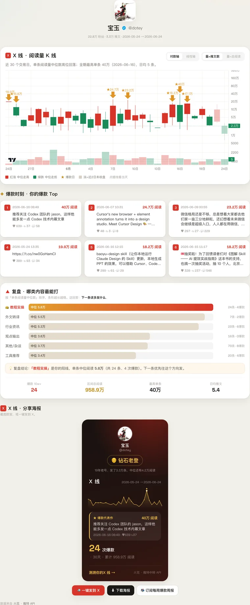
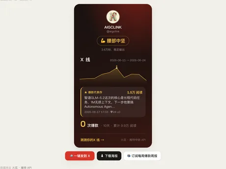

<p align="center">
  
</p>

<h1 align="center">X 线 · X-Kline</h1>

<p align="center"><em>给你的推特号拍个 X 光片：阅读量 K 线 + 人设鉴定。</em></p>

<p align="center">
  
</p>

把任意 X/Twitter 博主近一个月的推文做成一张**阅读量 K 线 + 自媒体人设**报告。以单条阅读量为价、统计分布蜡烛(box-plot)画日 K，自动算出主题阳线榜、爆款时刻、17 档人设（钻石老登 / 大喷子 / 出圈狂魔…），并生成可一键发到 X 的分享海报。

数据来自 [火花 · 推特 API](https://huohuaapi.com/data-sources/social-twitter)（social_twitter）。

两种用法：**命令行**（出一个 HTML 文件）或 **Web UI**（输入用户名即看）。

## 准备：火花 data-token

数据是计费的，需要火花 data-token。去 https://huohuaapi.com/console/data-access 复制后任选其一：

```bash
export HUOHUA_DATA_TOKEN='你的token'
# 或写入文件（权限 600）
mkdir -p ~/.config/huohua && printf '%s' '你的token' > ~/.config/huohua/data-token && chmod 600 ~/.config/huohua/data-token
```

> token 是计费凭证：只放环境变量或独立文件，**不要**提交进仓库或下发到浏览器。

## 用法 A · 命令行

```bash
python3 scripts/kline_report.py dotey                 # 出 dotey-kline.html
python3 scripts/kline_report.py @elonmusk --days 31 --out ./reports
```

把报告完整导出成一张长图（需 Chrome；装了 ImageMagick 会自动去白边）：

```bash
python3 scripts/export_png.py dotey-kline.html        # → dotey-kline.png
```

## 用法 B · Web UI（零依赖）

```bash
python3 webapp/server.py            # 打开 http://127.0.0.1:8787
```

输入用户名 → 后端拉数据、算 K 线、判人设 → 浏览器直接出报告。token 只待在服务器端。

## 报告内容

- **阅读量 K 线**：日 K；实体=当天单条阅读量四分位区间，上影=爆款、下影=哑火，红涨绿跌按中位数日环比；对数轴；点蜡烛看当天日内。
- **账号人设**：17 档里按数据自动判定一个。
- **你的流量密码**：哪类内容（教程/观点/转译/资讯/工具）最能打。
- **爆款时刻 + 代表作 + 分享海报**。

## 案例 · 不同博主，不同人设

人设按账号年龄、发推量、阅读中位、互动结构、数据波动等从 17 档里自动判定，每个号都不一样：

| | | |
|:--:|:--:|:--:|
| <br>**@Leobai825**<br>🚀 出圈狂魔 | <br>**@dotey**<br>👴 钻石老登 | <br>**@aigclink**<br>💪 腰部中坚 |

## 作为 AI Agent Skill

本目录同时是一个 Claude / OpenClaw skill（见 `SKILL.md`）。把目录放进 agent 的 skills 目录，agent 即可"给个用户名就生成报告"。

## 结构

```
.
├── SKILL.md                  # AI agent 技能说明书
├── README.md                 # 给人看的说明（本文件）
├── scripts/kline_report.py   # 流水线：拉数据→算K线/人设→渲染
├── assets/template.html      # 报告模板
└── webapp/server.py          # Web UI（标准库 http.server）
```

## 约束

- 只统计有 view_count 的**原创**推文；很老的推文（约 2023 前）无阅读量，会跳过。
- 「单日」按北京时间(UTC+8)切；近 2 天标「未收盘」。
- 阅读量是抓取时刻的累计快照，非发布当天值。
- 每次生成按火花计费规则扣费。

## License

MIT
